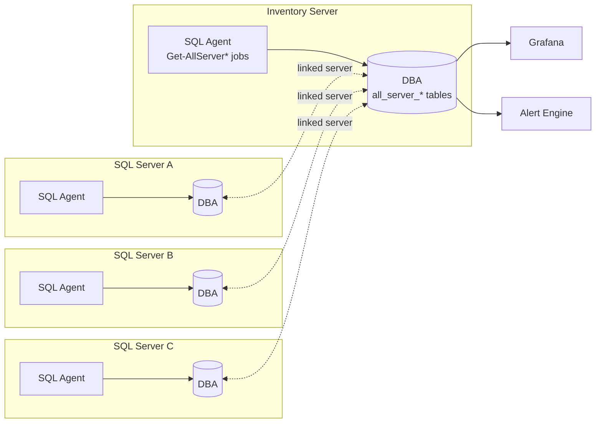
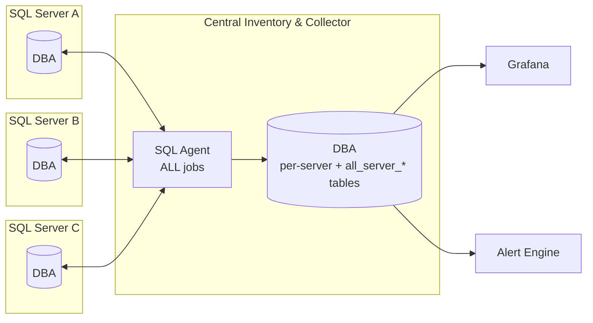

# Topology

SQLMonitor supports two deployment shapes. Both ship with the exact same scripts, stored procedures and dashboards &mdash; only the *location* of the SQL Agent jobs changes.

## Distributed topology (recommended default)

Every SQL Server instance collects its own metrics. A dedicated **Inventory server** holds the aggregation jobs and the Grafana data source.

**Who runs what:**

| Role | Jobs it runs | Typical instance |
|---|---|---|
| **Monitored instance** | All `(dba) Collect-*`, `(dba) Run-*`, `(dba) Check-SQLAgentJobs`, `(dba) Partitions-Maintenance`, `(dba) Purge-Tables`, `(dba) Remove-XEventFiles` | Every SQL instance in scope |
| **Inventory server** | All `(dba) Get-AllServer*`, `(dba) Check-InstanceAvailability`, `(dba) Update-SqlServerVersions`, `(dba) Populate Inventory Tables`, `(dba) Stop-StuckSQLMonitorJobs`, `(dba) Get-AllServerDashboardMail` | One dedicated instance |

**When to choose it:** medium-to-large fleets where you want the collection load *on* each instance, each instance has a reliable SQL Agent, and you can accept a linked-server hop for aggregation.

## Central topology

One central observability SQL Server runs **all** the jobs and polls every monitored instance via linked servers or direct ADO.NET connections.

**Who runs what:** every SQLMonitor job runs on the central instance. Monitored instances only need:

- Objects in `DBA` database (views + procs for the collector to call).
- The `grafana` login with `db_datareader` on `DBA`.
- Network access from the central instance.

**When to choose it:** small fleets, or when you cannot install SQL Agent jobs on every instance (Managed Instance, RDS with limited Agent, locked-down production).

## Hybrid variants

The `Install-SQLMonitor.ps1` parameters `SqlInstanceForTsqlJobs` and `SqlInstanceForPowershellJobs` let you route *specific job types* to a different server than the monitored instance:

- **T-SQL Jobs Server** &mdash; handles all T-SQL collection. Can be the monitored instance, another instance in the same cluster, or the inventory server.
- **PowerShell Jobs Server** &mdash; handles Perfmon, OS-process and disk-space collection (which require PowerShell and SMB access to the host). Same placement options.

This lets you, for example, keep heavyweight Perfmon collection off the monitored instance while still using SQL-Agent-native orchestration.

## Choosing a topology

Use **Distributed** unless one of these applies, in which case use **Central**:

- :material-cloud: Monitored instance is Azure SQL Managed Instance / RDS with restricted Agent.
- :material-lock: Security baseline forbids adding monitoring objects on PROD.
- :material-numeric-1-circle-outline: You have a very small fleet (1&ndash;3 servers).
- :material-server-off: Monitored instance is an older edition where partitioning/Memory-Optimized isn't attractive on the host.
